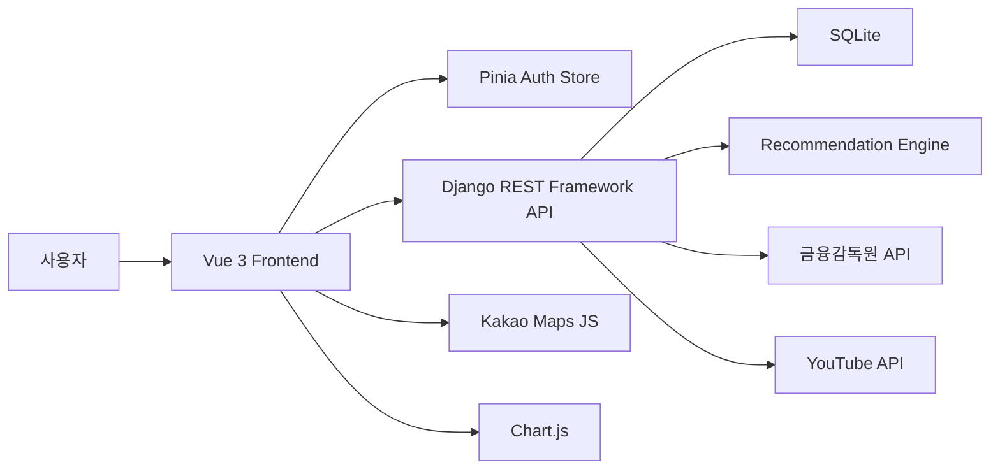
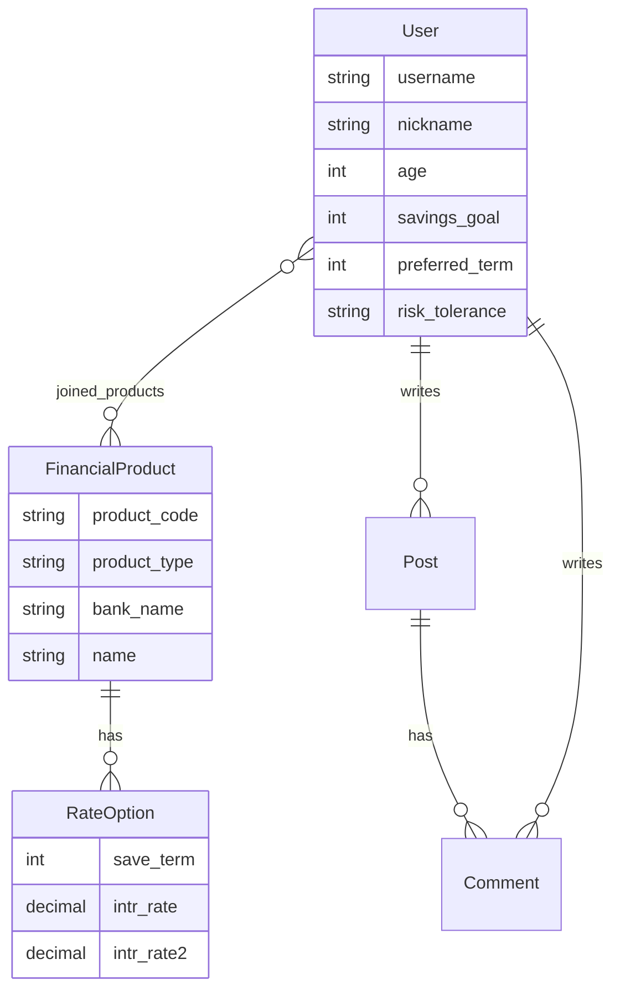

# FinPick - 금융 상품 비교 애플리케이션

13회차 금융 상품 추천 프로젝트 명세를 기준으로 만든 **프론트엔드/백엔드 분리형** 웹 애플리케이션입니다.

- Backend: Django 5.2 + Django REST Framework + Token Auth
- Frontend: Vue 3 + Pinia + Vue Router + Chart.js + Vite

기존 통합형 Django 템플릿 코드는 루트에 남아 있지만, 제출/실행 기준은 `backend/`와 `frontend/`입니다.

## 폴더 구조

```text
New project/
  backend/
    manage.py
    config/
    core/
      models.py
      serializers.py
      views.py
      urls.py
  frontend/
    package.json
    src/
      api/
      stores/
      views/
      components/
```

## 주요 기능

- 메인 페이지: 서비스 소개, 핵심 기능 카드, 추천 금리 상품
- 회원 관리: Custom User, 회원가입, 로그인, 로그아웃, Token 인증
- 예적금 비교: 상품 목록, 은행 필터, 검색, 상세 금리 옵션, 가입 목록 추가
- 금융감독원 API: `FINLIFE_API_KEY`로 정기예금/적금 데이터 갱신
- 현물 시각화: 금/은 가격 기간별 Chart.js 그래프
- 관심 종목: YouTube Data API 검색 및 iframe 상세 재생
- 근처 은행 검색: Kakao Maps JavaScript API, 은행 마커, 경로 Polyline
- 커뮤니티: 게시글/댓글 CRUD, 작성자 권한 체크
- 프로필: 회원 정보 수정, 가입 상품 리스트, 금리 그래프
- 추천: 사용자 금융 프로필 기반 상품 추천
- 킥포인트: 개인화 대시보드에서 목표 달성 가능성, 예상 만기 금액, 추천 그룹, 분석 차트 제공

## 백엔드 실행

한 번에 실행하려면 루트의 `start_finpick.bat`을 더블클릭합니다. 종료하려면 `stop_finpick.bat`을 실행하거나, 열린 Backend/Frontend 창에서 `Ctrl+C`를 누릅니다.

```bash
cd backend
python -m venv .venv
.venv\Scripts\activate
pip install -r requirements.txt
copy .env.example .env
python manage.py makemigrations
python manage.py migrate
python manage.py seed_demo
python manage.py createsuperuser
python manage.py runserver
```

백엔드 주소:

```text
http://127.0.0.1:8000/api/
```

헬스 체크:

```text
http://127.0.0.1:8000/api/health/
```

## 프론트엔드 실행

```bash
cd frontend
copy .env.example .env
pnpm install
pnpm dev
```

프론트 주소:

```text
http://127.0.0.1:5173/
```

## 환경 변수

백엔드 `backend/.env`

| 이름 | 설명 |
| --- | --- |
| `SECRET_KEY` | Django 비밀키 |
| `DEBUG` | 개발 환경에서는 `True` |
| `ALLOWED_HOSTS` | 백엔드 허용 호스트 |
| `CORS_ALLOWED_ORIGINS` | Vue 개발 서버 주소 |
| `FINLIFE_API_KEY` | 금융상품통합비교공시 API 키 |
| `YOUTUBE_API_KEY` | YouTube Data API v3 키 |
| `KAKAO_JS_KEY` | Kakao Maps JavaScript 키 |

Kakao Maps가 보이지 않을 때 확인할 것:

- 키는 루트 `.env`가 아니라 `backend/.env`의 `KAKAO_JS_KEY`에 넣습니다.
- Kakao Developers에서 REST API 키가 아니라 JavaScript 키를 사용합니다.
- Kakao Developers > 앱 설정 > 플랫폼 > Web 사이트 도메인에 `http://127.0.0.1:5173`을 등록합니다.
- `localhost`로 접속할 수도 있다면 `http://localhost:5173`도 같이 등록합니다.
- `.env`를 수정한 뒤에는 백엔드 서버를 재시작합니다.
- 확인 API: `http://127.0.0.1:8000/api/map/config/`

프론트엔드 `frontend/.env`

| 이름 | 설명 |
| --- | --- |
| `VITE_API_BASE_URL` | DRF API 주소 |

API 키가 없어도 데모 상품/가격/영상 데이터로 주요 화면을 확인할 수 있습니다.

## 주요 API

| Method | URL | 설명 |
| --- | --- | --- |
| `POST` | `/api/auth/signup/` | 회원가입 |
| `POST` | `/api/auth/login/` | 로그인 및 토큰 발급 |
| `GET/PATCH` | `/api/auth/me/` | 프로필 조회/수정 |
| `GET` | `/api/products/` | 상품 목록 |
| `GET` | `/api/products/{id}/` | 상품 상세 |
| `POST` | `/api/products/{id}/join/` | 가입 상품 추가 |
| `GET` | `/api/spot/` | 금/은 가격 데이터 |
| `GET` | `/api/videos/` | 관심 종목 영상 검색 |
| `GET/POST` | `/api/posts/` | 커뮤니티 목록/작성 |
| `POST` | `/api/posts/{id}/comments/` | 댓글 작성 |
| `GET` | `/api/recommendations/` | 상품 추천 |
| `GET` | `/api/dashboard/` | 개인화 대시보드 데이터 |

## 추천 알고리즘

추천 로직은 `backend/core/recommendation.py`에 있습니다.

- 금리 점수: 최고 우대금리 x 10
- 기간 점수: `30 - 선호 기간과 상품 기간 차이`
- 안정형 보너스: 예금 상품에 추가 점수
- 균형형/수익형 보너스: 적금 상품에 추가 점수

사용자 프로필의 `preferred_term`, `risk_tolerance`를 기준으로 점수를 계산하고, 가장 높은 상품을 추천합니다.

## 아키텍처



## ERD



## 생성형 AI 활용 내용

- 프로젝트 명세를 기능 단위로 분해
- DRF API 구조와 Vue 라우팅 구조 설계
- 추천 알고리즘 점수 기준 정리
- README의 아키텍처, ERD, API 표 작성 보조
