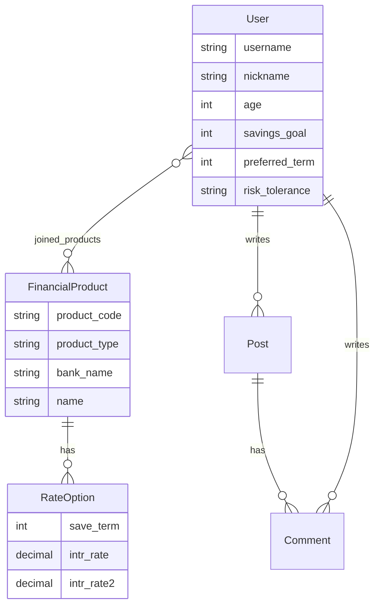

# FinPick - 湲덉쑖 ?곹뭹 鍮꾧탳 ?좏뵆由ъ??댁뀡

13?뚯감 湲덉쑖 ?곹뭹 異붿쿇 ?꾨줈?앺듃 紐낆꽭瑜?湲곗??쇰줈 留뚮뱺 **?꾨줎?몄뿏??諛깆뿏??遺꾨━??* ???좏뵆由ъ??댁뀡?낅땲??

- Backend: Django 5.2 + Django REST Framework + Token Auth
- Frontend: Vue 3 + Pinia + Vue Router + Chart.js + Vite

湲곗〈 ?듯빀??Django ?쒗뵆由?肄붾뱶??猷⑦듃???⑥븘 ?덉?留? ?쒖텧/?ㅽ뻾 湲곗??€ `backend/`?€ `frontend/`?낅땲??

## ?대뜑 援ъ“

```text
New project/
  backend/
    manage.py
    config/
    core/
      models.py
      serializers.py
      views.py
      urls.py
  frontend/
    package.json
    src/
      api/
      stores/
      views/
      components/
```

## 二쇱슂 湲곕뒫

- 硫붿씤 ?섏씠吏€: ?쒕퉬???뚭컻, ?듭떖 湲곕뒫 移대뱶, 異붿쿇 湲덈━ ?곹뭹
- ?뚯썝 愿€由? Custom User, ?뚯썝媛€?? 濡쒓렇?? 濡쒓렇?꾩썐, Token ?몄쬆
- ?덉쟻湲?鍮꾧탳: ?곹뭹 紐⑸줉, ?€???꾪꽣, 寃€?? ?곸꽭 湲덈━ ?듭뀡, 媛€??紐⑸줉 異붽?
- 湲덉쑖媛먮룆??API: `FINLIFE_API_KEY`濡??뺢린?덇툑/?곴툑 ?곗씠??媛깆떊
- ?꾨Ъ ?쒓컖?? 湲??€ 媛€寃?湲곌컙蹂?Chart.js 洹몃옒??- 愿€??醫낅ぉ: YouTube Data API 寃€??諛?iframe ?곸꽭 ?ъ깮
- 洹쇱쿂 ?€??寃€?? Kakao Maps JavaScript API, ?€??留덉빱, 寃쎈줈 Polyline
- 而ㅻ??덊떚: 寃뚯떆湲€/?볤? CRUD, ?묒꽦??沅뚰븳 泥댄겕
- ?꾨줈?? ?뚯썝 ?뺣낫 ?섏젙, 媛€???곹뭹 由ъ뒪?? 湲덈━ 洹몃옒??- 異붿쿇: ?ъ슜??湲덉쑖 ?꾨줈??湲곕컲 ?곹뭹 異붿쿇
- ?ν룷?명듃: 媛쒖씤???€?쒕낫?쒖뿉??紐⑺몴 ?ъ꽦 媛€?μ꽦, ?덉긽 留뚭린 湲덉븸, 異붿쿇 洹몃９, 遺꾩꽍 李⑦듃 ?쒓났

## 諛깆뿏???ㅽ뻾

??踰덉뿉 ?ㅽ뻾?섎젮硫?猷⑦듃??`start_finpick.bat`???붾툝?대┃?⑸땲?? 醫낅즺?섎젮硫?`stop_finpick.bat`???ㅽ뻾?섍굅?? ?대┛ Backend/Frontend 李쎌뿉??`Ctrl+C`瑜??꾨쫭?덈떎.

```bash
cd backend
python -m venv .venv
.venv\Scripts\activate
pip install -r requirements.txt
copy .env.example .env
python manage.py makemigrations
python manage.py migrate
python manage.py seed_demo
python manage.py createsuperuser
python manage.py runserver
```

諛깆뿏??二쇱냼:

```text
http://127.0.0.1:8000/api/
```

?ъ뒪 泥댄겕:

```text
http://127.0.0.1:8000/api/health/
```

## ?꾨줎?몄뿏???ㅽ뻾

```bash
cd frontend
copy .env.example .env
npm install
npm run dev
```

?꾨줎??二쇱냼:

```text
http://127.0.0.1:5173/
```

## ?섍꼍 蹂€??
諛깆뿏??`backend/.env`

| ?대쫫 | ?ㅻ챸 |
| --- | --- |
| `SECRET_KEY` | Django 鍮꾨???|
| `DEBUG` | 媛쒕컻 ?섍꼍?먯꽌??`True` |
| `ALLOWED_HOSTS` | 諛깆뿏???덉슜 ?몄뒪??|
| `CORS_ALLOWED_ORIGINS` | Vue 媛쒕컻 ?쒕쾭 二쇱냼 |
| `FINLIFE_API_KEY` | 湲덉쑖?곹뭹?듯빀鍮꾧탳怨듭떆 API ??|
| `YOUTUBE_API_KEY` | YouTube Data API v3 ??|
| `KAKAO_JS_KEY` | Kakao Maps JavaScript ??|

Kakao Maps媛€ 蹂댁씠吏€ ?딆쓣 ???뺤씤??寃?

- ?ㅻ뒗 猷⑦듃 `.env`媛€ ?꾨땲??`backend/.env`??`KAKAO_JS_KEY`???ｌ뒿?덈떎.
- Kakao Developers?먯꽌 REST API ?ㅺ? ?꾨땲??JavaScript ?ㅻ? ?ъ슜?⑸땲??
- Kakao Developers > ???ㅼ젙 > ?뚮옯??> Web ?ъ씠???꾨찓?몄뿉 `http://127.0.0.1:5173`???깅줉?⑸땲??
- `localhost`濡??묒냽???섎룄 ?덈떎硫?`http://localhost:5173`??媛숈씠 ?깅줉?⑸땲??
- `.env`瑜??섏젙???ㅼ뿉??諛깆뿏???쒕쾭瑜??ъ떆?묓빀?덈떎.
- ?뺤씤 API: `http://127.0.0.1:8000/api/map/config/`

?꾨줎?몄뿏??`frontend/.env`

| ?대쫫 | ?ㅻ챸 |
| --- | --- |
| `VITE_API_BASE_URL` | DRF API 二쇱냼 |

API ?ㅺ? ?놁뼱???곕え ?곹뭹/媛€寃??곸긽 ?곗씠?곕줈 二쇱슂 ?붾㈃???뺤씤?????덉뒿?덈떎.

## 二쇱슂 API

| Method | URL | ?ㅻ챸 |
| --- | --- | --- |
| `POST` | `/api/auth/signup/` | ?뚯썝媛€??|
| `POST` | `/api/auth/login/` | 濡쒓렇??諛??좏겙 諛쒓툒 |
| `GET/PATCH` | `/api/auth/me/` | ?꾨줈??議고쉶/?섏젙 |
| `GET` | `/api/products/` | ?곹뭹 紐⑸줉 |
| `GET` | `/api/products/{id}/` | ?곹뭹 ?곸꽭 |
| `POST` | `/api/products/{id}/join/` | 媛€???곹뭹 異붽? |
| `GET` | `/api/spot/` | 湲??€ 媛€寃??곗씠??|
| `GET` | `/api/videos/` | 愿€??醫낅ぉ ?곸긽 寃€??|
| `GET/POST` | `/api/posts/` | 而ㅻ??덊떚 紐⑸줉/?묒꽦 |
| `POST` | `/api/posts/{id}/comments/` | ?볤? ?묒꽦 |
| `GET` | `/api/recommendations/` | ?곹뭹 異붿쿇 |
| `GET` | `/api/dashboard/` | 媛쒖씤???€?쒕낫???곗씠??|

## 異붿쿇 ?뚭퀬由ъ쬁

異붿쿇 濡쒖쭅?€ `backend/core/recommendation.py`???덉뒿?덈떎.

- 湲덈━ ?먯닔: 理쒓퀬 ?곕?湲덈━ x 10
- 湲곌컙 ?먯닔: `30 - ?좏샇 湲곌컙怨??곹뭹 湲곌컙 李⑥씠`
- ?덉젙??蹂대꼫?? ?덇툑 ?곹뭹??異붽? ?먯닔
- 洹좏삎???섏씡??蹂대꼫?? ?곴툑 ?곹뭹??異붽? ?먯닔

?ъ슜???꾨줈?꾩쓽 `preferred_term`, `risk_tolerance`瑜?湲곗??쇰줈 ?먯닔瑜?怨꾩궛?섍퀬, 媛€???믪? ?곹뭹??異붿쿇?⑸땲??

## ?꾪궎?띿쿂

```mermaid
flowchart LR
  User["?ъ슜??] --> Vue["Vue 3 Frontend"]
  Vue --> Pinia["Pinia Auth Store"]
  Vue --> DRF["Django REST Framework API"]
  DRF --> DB["SQLite"]
  DRF --> Reco["Recommendation Engine"]
  DRF --> Finlife["湲덉쑖媛먮룆??API"]
  DRF --> YouTube["YouTube API"]
  Vue --> Kakao["Kakao Maps JS"]
  Vue --> Chart["Chart.js"]
```

## ERD



## ?앹꽦??AI ?쒖슜 ?댁슜

- ?꾨줈?앺듃 紐낆꽭瑜?湲곕뒫 ?⑥쐞濡?遺꾪빐
- DRF API 援ъ“?€ Vue ?쇱슦??援ъ“ ?ㅺ퀎
- 異붿쿇 ?뚭퀬由ъ쬁 ?먯닔 湲곗? ?뺣━
- README???꾪궎?띿쿂, ERD, API ???묒꽦 蹂댁“
## Social Login Setup

The app supports Kakao, Google, and Naver OAuth login.

Backend environment file: `backend/.env`

```env
FRONTEND_BASE_URL=http://127.0.0.1:5173
GOOGLE_CLIENT_ID=
GOOGLE_CLIENT_SECRET=
KAKAO_REST_API_KEY=
KAKAO_CLIENT_SECRET=
NAVER_CLIENT_ID=
NAVER_CLIENT_SECRET=
```

Important notes:

- Kakao social login uses the Kakao REST API key, not the JavaScript key.
- Kakao Maps still uses `KAKAO_JS_KEY`.
- Restart the backend after editing `backend/.env`.

Register these redirect URLs in each provider console:

```text
http://127.0.0.1:5173/social/callback/google
http://127.0.0.1:5173/social/callback/kakao
http://127.0.0.1:5173/social/callback/naver
```

If you also access the frontend with `localhost`, register these too:

```text
http://localhost:5173/social/callback/google
http://localhost:5173/social/callback/kakao
http://localhost:5173/social/callback/naver
```
